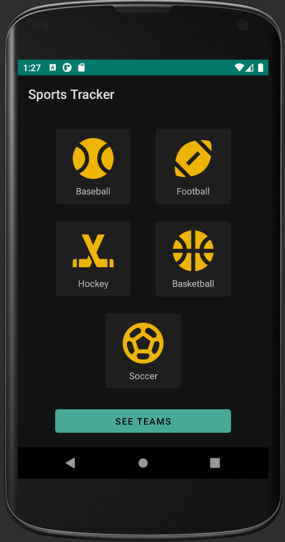

# Sports Tracker

# Description
Android application that allows user to choose a team from a category of sport.  They then can view the game history of that team.  This was the first time I've used Kotlin/Java, XML, and built for the Android system in general.

# Technologies Used
* Kotlin
* XML
* Retrofit
* LiveData
* MVVM Architecture

# Screenshot of App

# License
* 

# Contact
You can reach me by [email](mailto:jeffmullendev@gmail.com) and see my other projects at [github.com/jeffMullen](https://github.com/jeffMullen)